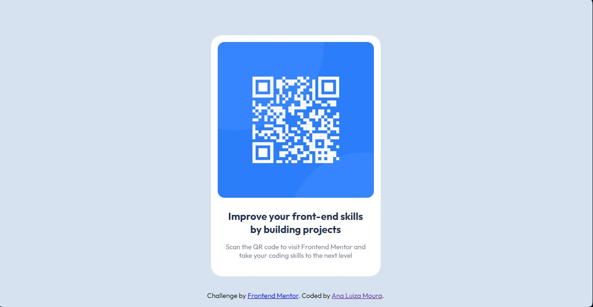

# Frontend Mentor - QR code component solution

This is a solution to the [QR code component challenge on Frontend Mentor](https://www.frontendmentor.io/challenges/qr-code-component-iux_sIO_H). Frontend Mentor challenges help you improve your coding skills by building realistic projects. 

## Table of contents

- [Overview](#overview)
  - [Screenshot](#screenshot)
  - [Links](#links)
- [My process](#my-process)
  - [Built with](#built-with)
- [Author](#author)

## Overview

### Screenshot

### Links

- Solution URL: [Solution](https://www.frontendmentor.io/solutions/qr-code-component-with-html5-and-css-w3VggxbnwG)
- Live Site URL: [QR code component](https://qr-code-component-ana-lsm.netlify.app)

## My process

### Built with

- Semantic HTML5 markup
- CSS custom properties
- Flexbox

## Author

- GitHub - [ana-lsm](https://github.com/ana-lsm)
- Frontend Mentor - [@ana-lsm](https://www.frontendmentor.io/profile/ana-lsm)
- Twitter - [@ana_lsm96](https://twitter.com/ana_lsm96)

